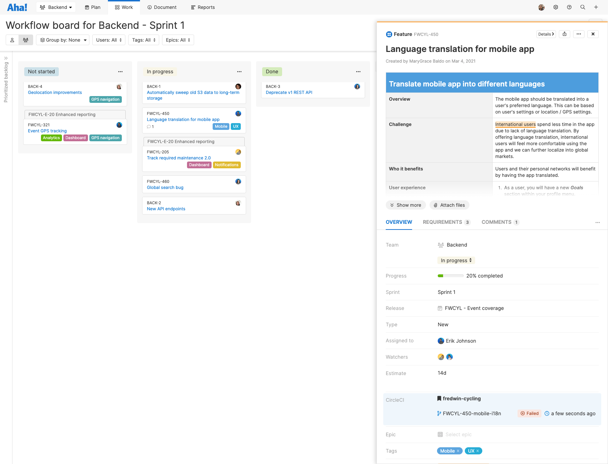
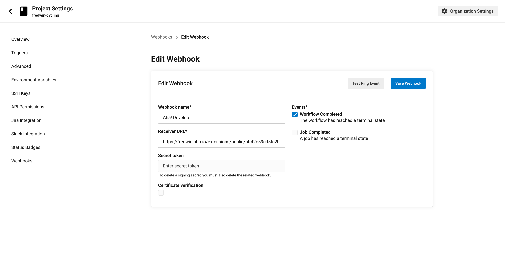

# CircleCI for Aha! Develop

This is an extension for [Aha! Develop](https://www.aha.io/develop) providing integration with CircleCI. It show the latest build status for each active branch directly on an Aha! Develop record.



## Installing the extension

**Note: In order to install an extension into your Aha! Develop account, you must be an account administrator.**

1. Install the CircleCI extension by clicking [here](https://secure.aha.io/settings/account/extensions/install?url=https://secure.aha.io/extensions/aha-develop.circle-ci.gz).
1. Visit **Account settings** > **Extensions** > **CircleCI integration** > **Hook from CircleCI**. Copy the provided URL.
1. [Configure a new webhook in CircleCI](https://circleci.com/docs/2.0/webhooks/#setting-up-a-hook) with this URL. Ensure that the **Workflow completed** event is checked. 
    
1. Add the new CircleCI field to your [record layouts in Aha! Develop](https://www.aha.io/support/develop/develop/customizations/custom-fields#place-the-custom-field-in-a-custom-layout).


## Working on the extension

Install `aha-cli`:

```sh
npm install -g aha-cli
```

Clone the repo:

```sh
git clone https://github.com/aha-develop/circleci.git
```

Install required modules:

```sh
yarn install
```

**Note: In order to install an extension into your Aha! Develop account, you must be an account administrator.**

Install the extension into Aha! and set up a watcher:

```sh
aha extension:install
aha extension:watch
```

Now, any change you make inside your working copy will automatically take effect in your Aha! account.

## Building

When you have finished working on your extension, package it into a `.gz` file so that others can install it:

```sh
aha extension:build
```

After building, you can upload the `.gz` file to a publicly accessible URL, such as a GitHub release, so that others can install it using that URL.

To learn more about developing Aha! Develop extensions, including the API reference, the full documentation is located here: [Aha! Develop Extension API](https://www.aha.io/support/develop/extensions)
